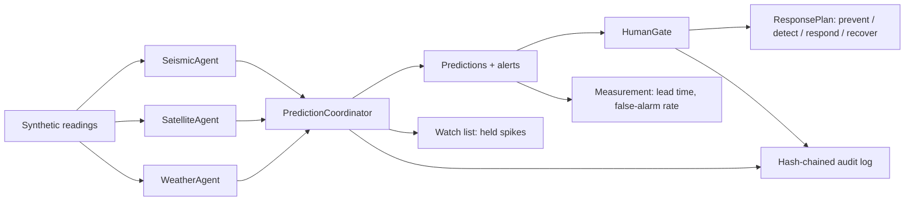

# Architecture diagram

```mermaid
flowchart LR
    S[Synthetic readings] --> SE[SeismicAgent]
    S --> SA[SatelliteAgent]
    S --> WE[WeatherAgent]
    SE --> C[PredictionCoordinator]
    SA --> C
    WE --> C
    C --> P[Predictions + alerts]
    C --> H[Watch list: held spikes]
    P --> G[HumanGate]
    G --> R[ResponsePlan: prevent / detect / respond / recover]
    C --> AU[Hash-chained audit log]
    G --> AU
    P --> M[Measurement: lead time, false-alarm rate]
```

See [docs/architecture.md](../docs/architecture.md).
